# The-Defect — 软件系统架构参考

> **平台**: ESP32-P4 (HP双核) + ESP32-C6 (协处理器)  
> **框架**: ESP-IDF 5.x / FreeRTOS / LVGL 9.4  
> **语言**: C++20  
> **屏幕**: 6" 720×1280 MIPI ILI9881C + GT911 电容触摸  

---

## 目录

1. [软件系统全景](#1-软件系统全景)
2. [基础设施层](#2-基础设施层)
3. [显示与输入](#3-显示与输入)
4. [App 导航系统](#4-app-导航系统)
5. [应用层](#5-应用层)
6. [网络层](#6-网络层)
7. [媒体与外设](#7-媒体与外设)
8. [屏幕串流](#8-屏幕串流)
9. [存储子系统](#9-存储子系统)
10. [启动流程](#10-启动流程)

---

## 1. 软件系统全景

### 1.1 总体架构

> 📷 **图片占位**: 在此放置六层软件架构全景图 (`images/arch-overview.png`)

The-Defect 的软件系统采用**分层模块化**设计，从上到下依次为：

```
┌──────────────────────────────────────────────────────────────────┐
│                        应用层 (Applications)                      │
│  DesktopApp │ Tetris │ FruitNinja │ Snake │ ChineseChess          │
│  BleSettings │ WifiSettings │ TimeSettings │ PowerManagement      │
├──────────────────────────────────────────────────────────────────┤
│                      App 导航系统 (Navigation)                     │
│  AppStackManager │ AppStack │ App 生命周期 (init/deinit/onFg/onBg)│
├───────────────────────────┬──────────────────────────────────────┤
│       显示与输入           │            网络服务                   │
│  LVGL + ILI9881C          │  HTTP Server (port 80)               │
│  GT911 触摸               │  WS Server (port 8080)               │
│  VirtualIndev (Web注入)   │  WiFi STA/AP 双模                    │
│  FontLoader (NotoSC)      │  mDNS 服务发现                       │
├───────────────────────────┴──────────────────────────────────────┤
│                      媒体 & 外设                                  │
│  ScreenStream (硬件JPEG) │ Audio (ES8311 + 多流混音)              │
│  BLE Gamepad (NimBLE, 4P)│ Battery (ADC) │ CPU Monitor            │
├──────────────────────────────────────────────────────────────────┤
│                        基础设施层                                  │
│  Task(协程调度器) │ Mutex(RAII) │ GPIO │ IIC │ GUI(色板+工厂)     │
│  FAT(16MB) │ memFS(6MB) │ SD Card │ NVS                          │
├──────────────────────────────────────────────────────────────────┤
│                      硬件/系统层                                   │
│  FreeRTOS 双核 │ PSRAM (主堆) │ PPA 2D 加速 │ HW JPEG 编码器      │
└──────────────────────────────────────────────────────────────────┘
```

### 1.2 双芯片分工

> 📷 **图片占位**: 在此放置 P4↔C6 双芯片通信架构图 (`images/dual-chip-arch.png`)

```
ESP32-P4 (主机)
├── HP Core 0 ── LVGL 渲染 + 游戏逻辑 + 网络服务
├── HP Core 1 ── FreeRTOS 空闲 / 后台任务
├── LP Core    ── Deep-sleep 唤醒检测
└── PPA / DMA2D / HW JPEG ── 2D 加速 + 编码

      ↕ SDIO (esp_hosted)

ESP32-C6 (协处理器)
├── NimBLE Controller ── BLE 射频 (手柄连接)
├── WiFi MAC/PHY      ── STA/AP 双模
└── 通过 SDIO 转发到 P4 的 esp_netif
```

### 1.3 关键数据流

> 📷 **图片占位**: 在此放置全局数据流图 (`images/data-flow.png`)

```mermaid
flowchart TB
    subgraph Input["输入层"]
        BLE[BLE 手柄 x4] -->|GamepadState| App
        Touch[GT911 触摸] -->|lv_indev| LVGL
        Web[Web 远程触控] -->|VirtualIndev| LVGL
    end

    subgraph Logic["应用逻辑层"]
        App[App 基类] -->|onGamepadInput| GameApp[游戏 App]
        App -->|push/pop/replace| SM[AppStackManager]
        SM -->|activeApp| App
        GameApp -->|GameState| WS[WS Server]
        WS -->|snapshot| Remote[远程客户端]
    end

    subgraph Render["渲染输出层"]
        LVGL[LVGL 9.4] -->|flush| Bridge[Bridge 帧缓冲]
        Bridge -->|disp_fb| Panel[ILI9881C 屏幕]
        Bridge -->|on_frame_ready| SS[ScreenStream]
        SS -->|HW JPEG| HTTP[HTTP Server]
        HTTP -->|MJPEG 流| Browser[浏览器]
    end

    subgraph AudioLayer["音频层"]
        GameApp -->|play()| Audio[Audio Manager]
        Audio -->|PCM| ES8311[ES8311 编解码器]
        ES8311 -->|I²S| Speaker[扬声器]
    end
```

---

## 2. 基础设施层

### 2.1 Task — 协程调度器

**文件**: `main/task/task.hpp/cpp`

FreeRTOS 之上的轻量轮询式协程调度器，替代裸任务管理。

```mermaid
flowchart LR
    subgraph Init["初始化"]
        A[Task::init(2)] -->|创建 daemon 线程| D1[Daemon Thread 0]
        A -->|创建 daemon 线程| D2[Daemon Thread 1]
    end

    subgraph Schedule["轮询调度"]
        D1 -->|循环| Poll[遍历 Task 链表]
        Poll -->|callTick 到期?| Run[执行 Function_t]
        Run -->|return waitMs| Sleep[睡眠 waitMs]
        Sleep --> Poll
    end

    subgraph API["对外接口"]
        Add[addTask] -->|注册| List[Task 链表]
        Remove[removeTask] -->|注销| List
        SetAff[setAffinity] -->|绑定 CPU| List
    end
```

| 接口 | 输入 | 输出 | 说明 |
|------|------|------|------|
| `Task::init(n)` | daemon 线程数 | — | 创建 n 个 FreeRTOS daemon 线程 |
| `Task::addTask(func, name, param, tick, affinity)` | 函数指针、参数、唤醒间隔、CPU亲和性 | `Task*` | 注册轮询任务 |
| `Task::removeTask(task)` | Task 指针 | — | 注销任务 |
| `Function_t` 返回值 | — | `TickType_t` | 下次唤醒延迟(ms)，`infinityTime`=永不唤醒 |

**关键设计点**:
- daemon 线程共享 Task 链表，`setAffinity(None)` 的任务可跨线程执行
- 优先级常量：`Deamon(2)` ~ `RealTime(8)`
- 用于：FPS 监控、电量轮询、BLE 输入处理、延迟的 App 栈操作

### 2.2 Mutex — RAII 互斥锁

**文件**: `main/mutex/mutex.hpp`

```mermaid
flowchart LR
    A[构造 Mutex] -->|xSemaphoreCreateMutex| M[Mutex]
    M -->|lock()| L[Lock 保护区域]
    L -->|unlock() 或 Lock 析构| M
    M -->|析构| D[等待无人持有 → vSemaphoreDelete]
```

| 类 | 方法 | 说明 |
|------|------|------|
| `Mutex` | `lock() / unlock() / try_lock()` | **非递归** FreeRTOS 互斥锁 |
| `Lock` | 构造时 lock，析构时 unlock | RAII 包装器 |

> ⚠ 与 `Display::LockGuard` 的区别：后者是 LVGL 的**递归互斥锁**，同一 Task 可嵌套加锁。

### 2.3 GPIO — 引脚封装

**文件**: `main/gpio/gpio.hpp`

| 操作符 | 行为 | 示例 |
|--------|------|------|
| `=` | 写电平 | `gpio = true;` |
| `bool` | 读电平 | `if (gpio) { ... }` |
| `GPIO_NUM` | 取引脚号 | `i2c_master_bus_init(gpio, ...)` |
| `int` | 转整数 | — |

**典型使用**:
```cpp
GPIO paPin{ GPIO_NUM_53, GPIO_MODE_OUTPUT };
paPin = true;  // 功放使能

GPIO btn{ GPIO_NUM_0, GPIO_MODE_INPUT, GPIO_PULLUP_ONLY };
if (!btn) { /* 按钮按下 */ }
```

### 2.4 IIC — I²C 总线

**文件**: `main/iic/iic.hpp/cpp`

| 类 | 功能 |
|------|------|
| `IIC` | 主控总线管理：构造时初始化 i2c_master_bus，析构时删除。支持自动端口选择 (`IicPortAuto`) |
| `IICDevice` | 设备封装：提供 `detect()` / `transmit()` / `receive()` / `request()` |

**硬件连接**:
```
IIC 总线 (GPIO7=SCL, GPIO8=SDA)
├── GT911 触摸 (0x5D / 0x14)
└── ES8311 音频 (0x30)
```

---

## 3. 显示与输入

### 3.1 Display — LVGL 适配层

**文件**: `main/display/display.hpp/cpp`

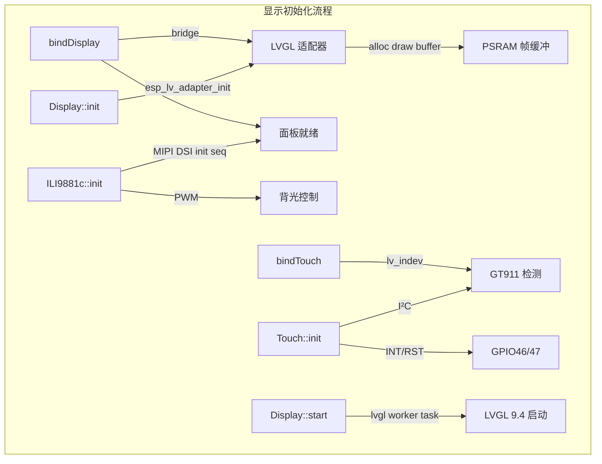

| 接口 | 输入 | 输出 | 说明 |
|------|------|------|------|
| `init()` | — | `bool` | 初始化 LVGL 适配器 |
| `bindDisplay(panel, io, w, h, tear, rot)` | 面板/IO句柄、分辨率、防撕裂模式、旋转 | `bool` | 绑定 ILI9881c 面板 |
| `bindTouch(handle)` | GT911 句柄 | `bool` | 绑定触摸输入 |
| `start()` | — | `bool` | 创建 LVGL worker task |
| `lockGuard()` | — | `LockGuard` | RAII 递归锁 |
| `setBrightness(pct)` | 0~100 | — | 委托 ILI9881c PWM |
| `getFps()` | — | `uint32_t` | 当前帧率 |

### 3.2 FontLoader — 字体引擎

**文件**: `main/display/font.cpp`

```mermaid
flowchart LR
    subgraph Load["字体加载"]
        L[FontLoader::load] -->|"F:system/NotoSC.ttf"| VFS[VFS 驱动 'F']
        VFS -->|convert: F:→/root/| FAT[/root/system/NotoSC.ttf]
        FAT -->|FreeType| FONT[lv_font_t*]
    end

    subgraph Default["全局默认"]
        SD[setDefault] -->|FontSize::Small 24px| FS
        SD -->|FontSize::Medium 32px| FM
        SD -->|FontSize::Large 56px| FL
        FM -->|fallback| LV[LVGL symbol font]
    end
```

| 接口 | 输入 | 输出 | 说明 |
|------|------|------|------|
| `load(vfsPath, size)` | VFS路径、字号 | `const lv_font_t*` | 从 FAT 加载 FreeType 字体 |
| `getDefault(size)` | 字号枚举 | `const lv_font_t*` | 取全局默认字体 |
| `setDefault(font, size)` | 字体指针、字号 | `bool` | 设置全局默认字体 |

**字体回退链**: NotoSC 缺失符号（电池图标等）→ LVGL 内置 symbol 字体

### 3.3 VirtualIndev — 虚拟触摸输入

**文件**: `main/virtualIndev/virtualIndev.hpp/cpp`

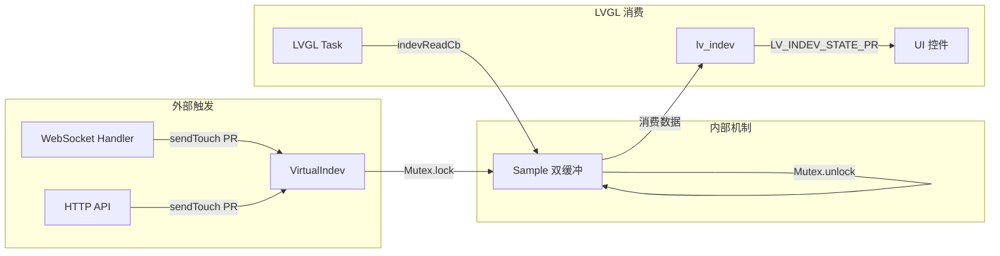

| 接口 | 输入 | 输出 | 说明 |
|------|------|------|------|
| `start(display)` | Display 指针 | `bool` | 注册到 LVGL indev 系统 |
| `sendTouch(state, point)` | PR/REL + 坐标 | — | 注入触摸事件 |

---

## 4. App 导航系统

### 4.1 架构总览

**文件**: `main/app/app.hpp/cpp`, `appStack.hpp/cpp`, `appStackManager.hpp/cpp`

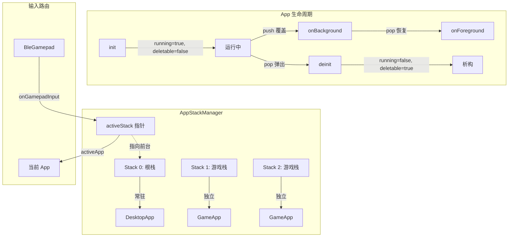

### 4.2 栈操作时序

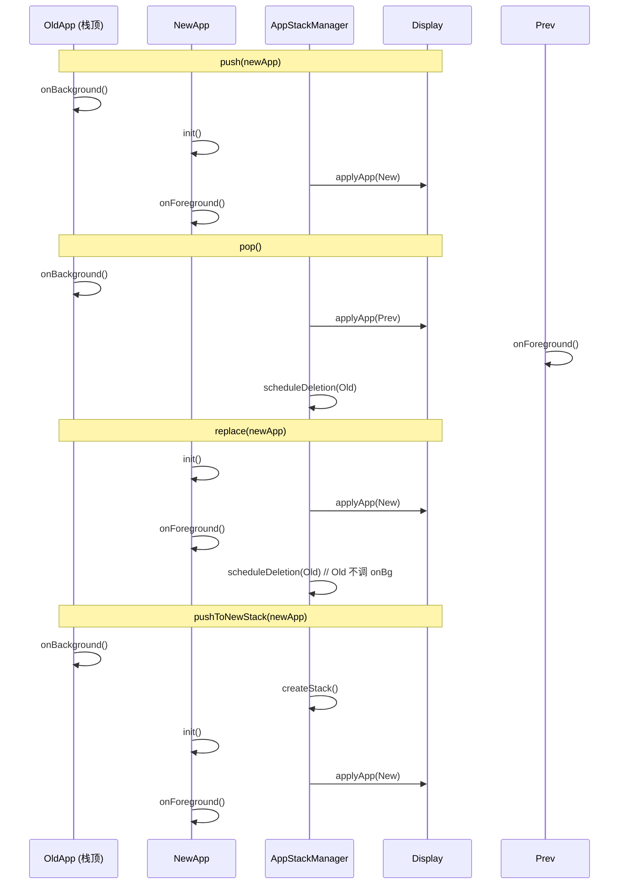

### 4.3 App 基类接口

| 方法 | 触发时机 | 关键行为 |
|------|----------|----------|
| `init()` | App 首次入栈 | `running=true, deletable=false` |
| `deinit()` | App 被弹出 | `running=false, deletable=true` |
| `onForeground()` | 成为栈顶 | 启动定时器/传感器 |
| `onBackground()` | 被覆盖 | 暂停耗时任务 |
| `onGamepadInput(pid, state)` | BLE 手柄输入 | 手柄路由到当前活跃 App |
| `pushApp(app)` | 便利方法 | 委托当前栈的 push |
| `popApp()` | 便利方法 | 委托当前栈的 pop |
| `replaceWith(app)` | 便利方法 | 委托当前栈的 replace |

### 4.4 去重机制

AppStack 不提供内置防重入，所有栈操作入口需手动实现时间戳去重：

```
m_nextActionTime = xTaskGetTickCount() + 500ms  // 500ms 冷却
```

---

## 5. 应用层

### 5.1 应用列表

> 📷 **图片占位**: 在此放置游戏截图组合 (`images/games-screenshot.png`)

| App | 路径 | 类型 | 输入 | 联机 | 核心逻辑 |
|-----|------|------|------|------|----------|
| **DesktopApp** | `app/desktopApp/` | 桌面 | 手柄/触屏 | — | 5 卡片网格，3 焦点组导航 |
| **TetrisApp** | `app/tetris/` | 游戏 | BLE 手柄 | ✅ 3P | Host-authoritative, 7-bag, SRS |
| **FruitNinjaApp** | `app/fruitNinja/` | 游戏 | 触屏/Web | ✅ 2P | 房间系统 |
| **Snake** | `app/snake/` | 游戏 | BLE 手柄 | ✅ 4P | 房间配对 |
| **ChineseChess** | `app/chineseChess/` | 游戏 | 手柄/触屏 | ✅ 双人 | AI 引擎 (chessAI.cpp) |
| **BleSettingsApp** | `app/bleSettingsApp/` | 设置 | 手柄/触屏 | — | 扫描/配对/NVS |
| **WifiSettingsApp** | `app/wifiSettingsApp/` | 设置 | 手柄/触屏 | — | 扫描/连接/密码键盘 |
| **TimeSettingsApp** | `app/timeSettingsApp/` | 设置 | 手柄/触屏 | — | SNTP / 手动调时 |
| **PowerManagementApp** | `app/powerManagementApp/` | 设置 | 手柄/触屏 | — | 电量/Deep-sleep |

### 5.2 桌面导航 (DesktopApp)

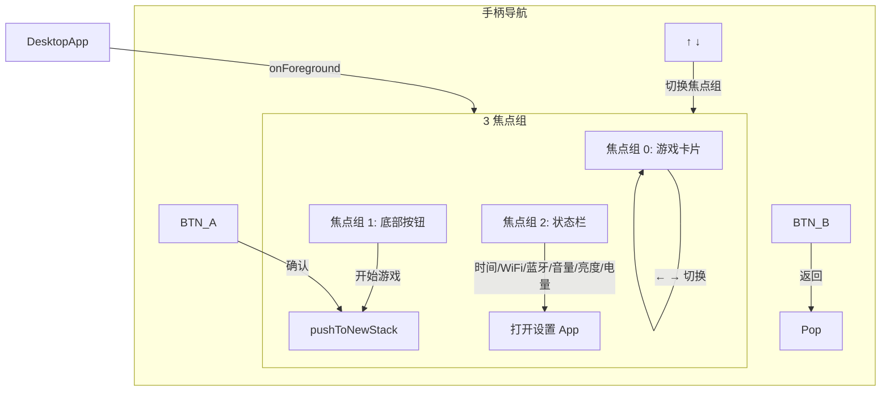

**关键变量**:
| 变量 | 类型 | 初值 | 说明 |
|------|------|------|------|
| `m_focusGroup` | `FocusGroup` | `FOCUS_CARDS` | 当前活跃焦点组 |
| `m_focusCardsIdx` | `int8_t` | 0 | 卡片索引 0..4 |
| `m_nextActionTime` | `TickType_t` | 0 | 去重时间戳 (500ms 冷却) |
| `m_nextMoveTime[4]` | `TickType_t` | 0 | 手柄方向键去重 (首次300ms, 重复120ms) |

### 5.3 俄罗斯方块 (TetrisApp)

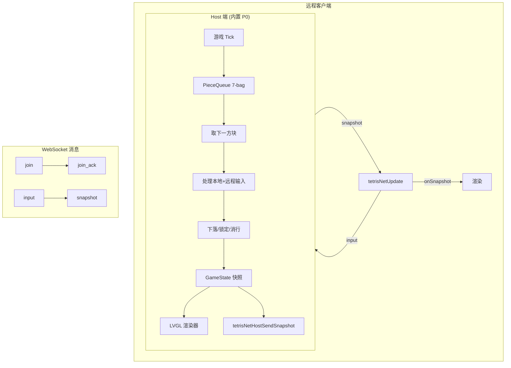

| 模块 | 文件 | 关键输入 | 关键输出 |
|------|------|----------|----------|
| `PlayerState` | `gameLogic/player_state.cpp` | 输入事件、当前方块 | 更新后的 board/piece/score |
| `PieceQueue` | `gameLogic/tetris_client.hpp` | 7-bag 随机种子 | 下一个方块类型 |
| `GameState` | `gameLogic/gameState.hpp` | 所有 PlayerState 序列化 | JSON 快照 |
| `tetris_net` | `net/tetris_net.cpp` | WS 消息 (join/input) | 广播 snapshot |
| `tetris_renderer` | `renderer/tetris_renderer.cpp` | GameState | LVGL 对象更新 |

---

## 6. 网络层

### 6.1 网络架构总览

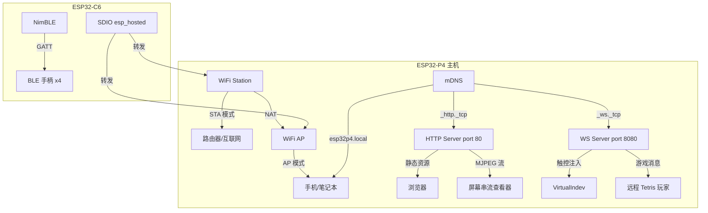

### 6.2 WiFi 模式切换

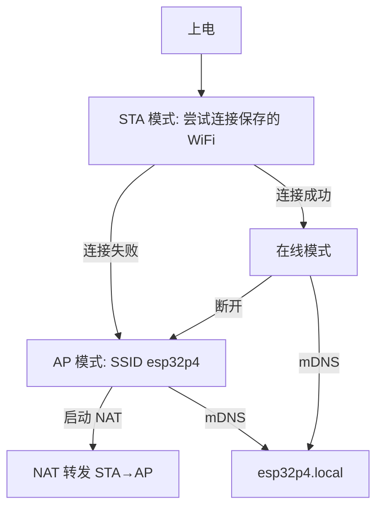

| 接口 | 输入 | 输出 | 说明 |
|------|------|------|------|
| `wifiInit(remote)` | bool (是否通过 C6) | — | 初始化 WiFi 栈 |
| `wifiStationStart()` | — | — | 启动 STA |
| `wifiConnect(ssid, pass)` | SSID + 密码 | — | 连接 AP |
| `wifiApStart()` | — | — | 启动 AP 热点 |
| `wifiNatStart()` | — | — | STA→AP NAT 转发 |
| `wifiStationScan()` | — | AP 列表 | 同步扫描 |

### 6.3 HTTP Server

**文件**: `main/server/serverKernal.cpp`, `main/wifi/socketStreamWindow.hpp`

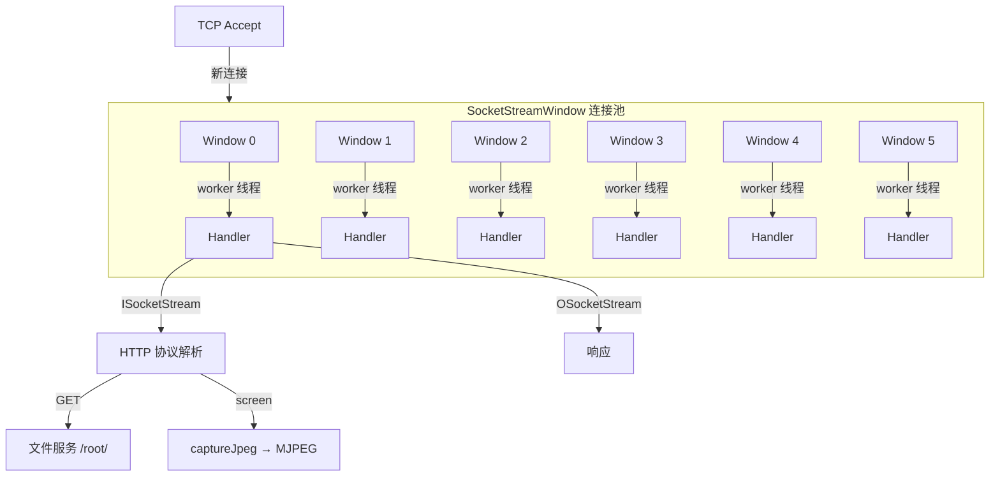

| 组件 | 说明 |
|------|------|
| **SocketStreamWindow** | 6 窗口连接池，Mutex 保护，`setSocket/getSocketStream/closeSocket` |
| **ISocketStream** | TCP 输入流，64 字节缓冲，支持 `get/peek/read/getline` |
| **OSocketStream** | TCP 输出流，支持 `put/print/sendNow` |
| **serverStart(3)** | 裸 socket, port 80, 自动重试 3 次 |

### 6.4 WebSocket Server

**文件**: `main/wsServer/wsServer.hpp/cpp`

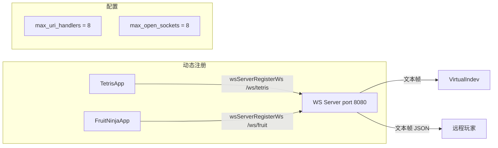

| 接口 | 输入 | 输出 | 说明 |
|------|------|------|------|
| `wsServerRegisterWs(uri, handler)` | URI + 函数指针 | `bool` | 注册 handler |
| `wsServerUnregister(uri)` | URI | — | 注销 |
| `wsServerSendText(fd, data, len)` | socket fd + JSON 数据 | `esp_err_t` | 单播 |
| `wsServerBroadcastText(data, len)` | JSON 数据 | `esp_err_t` | 广播 |

---

## 7. 媒体与外设

### 7.1 Audio 子系统

**文件**: `main/audio/ES8311.hpp/cpp`, `Audio.hpp/cpp`

```mermaid
flowchart TB
    subgraph HW["硬件层"]
        ES[ES8311 编解码器]
        I2S[I²S: MCLK13 BCK12 WS10 DOUT9]
        PA[PA 使能 GPIO53]
    end

    subgraph Manager["音频管理器 Audio (Singleton)"]
        Play[Audio::play(path)] -->|创建| AH[AudioHandle]
        AH -->|setLoop true| Loop[循环播放]
        AH -->|detach| DT[解绑生命周期]
        AH -->|play| Open[打开 render stream]
        
        Master[setMasterVolume] -->|委托| ES
        NVS[loadVolumeFromNvs] -->|恢复音量| Master
    end

    subgraph DataFlow["数据流"]
        FAT[FAT 文件] -->|读| EncBuf[编码缓冲 8KB]
        EncBuf -->|esp_audio_dec_process| DecBuf[解码缓冲 16KB]
        DecBuf -->|*volume| Stream[render stream_write]
        Stream -->|Mixer Thread| Out[outWriter → ES8311]
    end
```

| 类 | 方法 | 说明 |
|------|------|------|
| `ES8311` | `init(iic, config)` / `open(fs)` / `play(data, len)` / `setVolume(0-100)` | 编解码器驱动 |
| `Audio` | `instance()` / `init(codec)` / `play(path)` / `setMasterVolume(n)` | 管理器单例 |
| `AudioHandle` | `setLoop(bool)` / `setVolume(0.0~1.0)` / `play()` / `stop()` / `detach()` | 值类型句柄 |

**生命周期模型** (效仿 `std::thread`):
| 模式 | 行为 |
|------|------|
| **绑定** (默认) | handle 析构 → 发停止信号 → 等待 task 退出 → 释放 stream |
| **detach** | 自动 play() + 解绑，handle 析构静默，task 运行完后自行清理 |

### 7.2 BLE Gamepad

**文件**: `main/bleGamepad/bleGamepad.hpp/cpp`, `gamepadState.hpp`

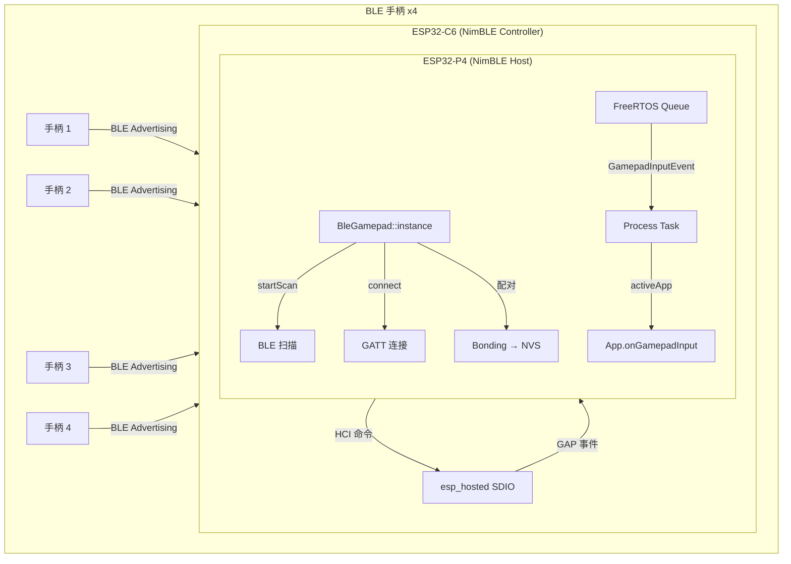

| 接口 | 输入 | 输出 | 说明 |
|------|------|------|------|
| `start(display)` | Display 指针 | `bool` | 初始化 NimBLE + esp_hosted |
| `startScan()` | — | — | BLE 扫描 |
| `connect(scanIndex)` | 扫描结果索引 | — | GATT 连接 |
| `disconnect(playerId)` | 玩家 ID | — | 断开指定玩家 |
| `getBatteryLevel(pid)` | 玩家 ID | 0~100 / 255=未知 | 通过 BLE Battery Service 读取 |
| `syncPairedToNvs()` | — | — | 持久化配对设备列表 |

**GamepadState 结构**:
```cpp
struct GamepadState {
    uint16_t buttons;        // GamepadButton 位图
    uint8_t lx{128}, ly{128}; // 左摇杆 0~255 (中心128)
    uint8_t rx{128}, ry{128}; // 右摇杆
    uint8_t lt{0}, rt{0};    // 扳机
    uint8_t dpad{15};         // D-pad 0~7=方向, 15=松开
};
```

### 7.3 Battery Manager

**文件**: `main/battery/batteryManager.hpp/cpp`

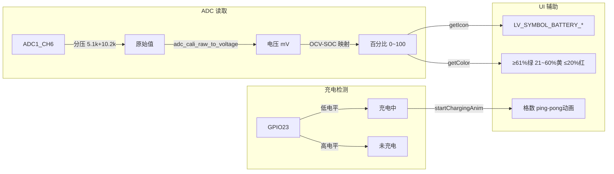

| 接口 | 返回值 | 说明 |
|------|--------|------|
| `getPercent()` | 0~100 / -1 | 电量百分比 |
| `getVoltageMv()` | mV / -1 | 电池电压 |
| `isCharging()` | bool | 充电状态 |
| `getIcon(pct)` | `const char*` | LVGL 电池图标 |
| `getColor(pct)` | `lv_color_t` | 电量颜色 |

---

## 8. 屏幕串流

### 8.1 零拷贝原理

**文件**: `main/screenStream/screenStream.hpp/cpp`

> 📷 **图片占位**: 在此放置串流数据流对比图 (`images/stream-comparison.png`)

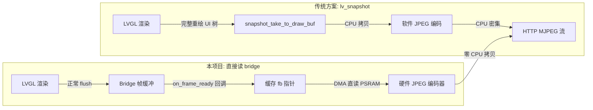

| 阶段 | 传统方案 | 本项目 |
|------|----------|--------|
| 渲染 | 全 UI 树重绘到新 buffer | 读取 bridge 已有的 front buffer |
| 拷贝 | CPU 从 framebuffer 拷贝 | DMA 直读 PSRAM，零 CPU 参与 |
| 编码 | 软件 JPEG（CPU 密集） | 硬件 JPEG 编码器（专用电路） |
| 空闲态 | 无区别 | 1 次 null 指针检查/帧 |

### 8.2 ScreenStream 接口

```cpp
// 启动（注册帧回调 + 初始化 JPEG 编码器）
ScreenStream::instance().start(&display, 720, 1280);

// 按需采集一帧 JPEG（HTTP handler 中调用）
size_t jpegSize = ScreenStream::instance().captureJpeg(buffer, bufSize);

// 停止（注销回调 + 释放编码器）
ScreenStream::instance().stop();
```

### 8.3 帧回调触发链

```
esp_lvgl_adapter bridge flush 完成
    ↓
display_bridge.h: on_frame_ready(disp, disp_fb, size, ctx)
    ↓
display_manager.c: display_manager_set_frame_ready_callback()
    ↓
ScreenStream::frameReadyCallback()
    ↓  (只写指针，~2-3 周期)
m_cachedFrame = disp_fb
m_cachedFrameSize = fbSize
```

---

## 9. 存储子系统

### 9.1 VFS 挂载点

```mermaid
flowchart TB
    subgraph Physical["物理存储"]
        FAT_P[FAT 分区 16MB] -->|spi_flash| Flash[Flash]
        MEM_P[PSRAM 6MB] -->|SPI RAM| PSRAM[PSRAM]
        SD_P[SD 卡] -->|SPI/SDMMC| SD_Card[SD Card]
    end

    subgraph VFS["VFS 虚拟文件系统"]
        FAT_V[/root/] -->|mountFlash| FAT_P
        MEM_V[/root/mem] -->|mountMem| MEM_P
        SD_V[/root/sd] -->|mountSd| SD_P
    end

    subgraph API["文件操作 API"]
        FAT_V -->|newFile/removeFile/tree| CRUD[文件 CRUD]
        FAT_V -->|FileBase open/read/write/seek| Stream[流式 I/O]
    end
```

### 9.2 FAT 分区 API

| 接口 | 说明 |
|------|------|
| `mountFlash()` | 挂载 fat 分区到 `/root/` |
| `formatFlash()` | 格式化 FAT 分区 |
| `newFile(path)` | 创建文件 |
| `removeFile(path)` | 删除文件 |
| `newFloor(path)` | 创建目录 |
| `tree(path)` | 递归列出文件树 |
| `getSpace(&free, &total)` | 获取磁盘空间 |

```
/root/ 目录结构:
├── system/
│   └── NotoSC.ttf        ← 系统字体
├── server/
│   ├── index.html        ← HTTP 首页
│   ├── index.css
│   ├── screen/           ← 串流查看器
│   ├── tetris/           ← Tetris 网页客户端
│   └── wifi/             ← WiFi 配置页
├── music/                ← 音频文件
└── ...                   ← 运行时文件
```

---

## 10. 启动流程

### 10.1 完整启动时序

> 📷 **图片占位**: 在此放置启动时序图 (`images/boot-sequence.png`)

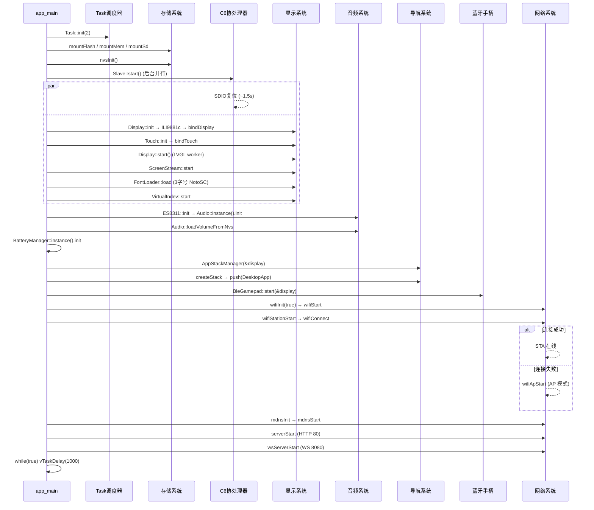

### 10.2 启动参数汇总

| 初始化项 | 耗时 | 线程/方式 | 是否阻塞 |
|----------|------|-----------|----------|
| Task::init | <1ms | 主线程 | 是 |
| mountFlash/mem/Sd | ~50ms | 主线程 | 是 |
| C6 Slave SDIO 复位 | ~1500ms | 后台 Task | **否** (并行) |
| Display/LVGL/ILI9881c | ~200ms | 主线程 | 是 |
| ScreenStream | <10ms | 主线程 | 是 |
| FontLoader (3x NotoSC) | ~100ms | 主线程 | 是 |
| Audio init | ~50ms | 主线程 | 是 |
| Battery ADE | ~10ms | 主线程 | 是 |
| BLE NimBLE + esp_hosted | ~500ms | 主线程 | 是 |
| WiFi (等待 C6 就绪) | ~100ms | 主线程 | 否 (wifiInit 不阻塞) |
| mDNS | <10ms | 主线程 | 是 |
| HTTP/WS Server | <10ms | 主线程 | 是 |

**总耗时**: ~400ms (不含 C6 并行部分) / ~1900ms (含 C6 等待)

---

## 附: PPA 硬件加速

### 关键配置

```c
CONFIG_LV_USE_PPA=y                // 启用 PPA
CONFIG_LV_USE_PPA_IMG=y            // PPA 加速图片渲染
CONFIG_LV_DRAW_SW_DRAW_UNIT_CNT=1  // PPA 要求 =1
CONFIG_LV_CACHE_DEF_SIZE=1048576   // 图片缓存 1MB
```

### 性能约束

| 参数 | 约束 | 说明 |
|------|------|------|
| SW draw unit count | 必须 =1 | >1 会导致渲染错误 (黑线/白线) |
| PPA fill/blend pending | ≥2 (打补丁后=8) | 默认=1 在多线程渲染时会队列溢出拒绝启动 |
| 阴影 (shadow_width) | 适度使用 | 模糊运算开销大 |
| 圆角 (radius) | 可使用 | 远小于阴影的开销 |

> PPA fill/blend 与 SRM 共享硬件引擎，大量 blend 会阻塞 SRM 旋转。

---

## 修订记录

| 日期 | 版本 | 说明 |
|------|------|------|
| 2026-07-08 | v1.0 | 初版，覆盖全部 10 个章节 |
